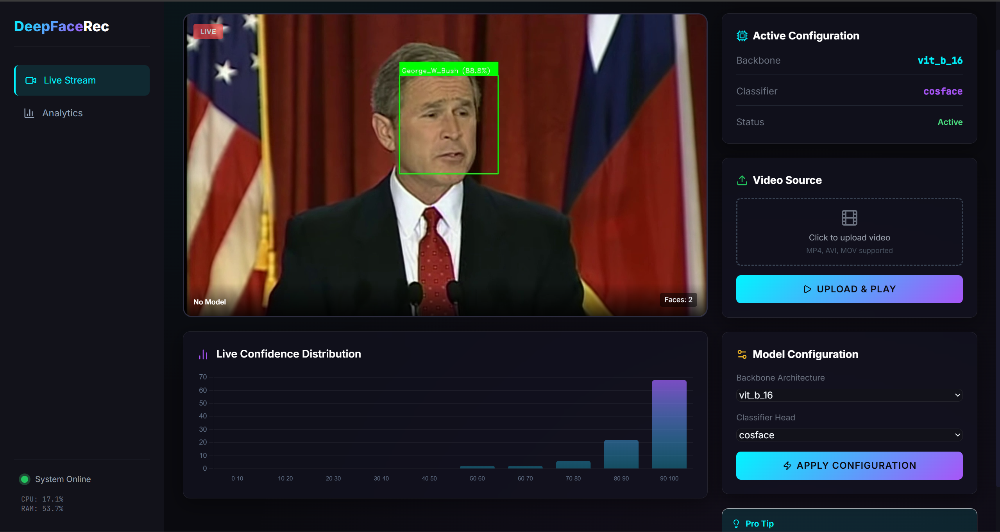

# 🤖 Deep Learning: Advanced Face Recognition System

[](https://www.python.org/)
[](https://flask.palletsprojects.com/)
[](https://pytorch.org/)
[](https://scikit-learn.org/)
[](https://opencv.org/)

## 📝 Project Context
This project was developed as part of the **Deep Learning** module. It represents a comprehensive exploration of face recognition architectures, focusing on the trade-offs between various backbones and classifier heads. We utilized the **Labelled Faces in the Wild (LFW)** dataset for training and evaluation.

## 🚀 Project Overview
We conducted an extensive benchmarking study, training and evaluating **90 different models**. This was achieved by combining multiple state-of-the-art backbones with various classical and neural classifier heads.

- **Scale:** 90 unique model combinations.
- **Effort:** Spanning **3 detailed notebooks** covering different architecture families.
- **Training Time:** Approximately **30 hours** of total compute time.
- **Backbone Architectures:** VGG16, ResNet50/101, EfficientNetB0/B3, DenseNet121, MobileNetV3, ConvNeXt Tiny, Vision Transformer (ViT-S/B), Swin Transformer.
- **Classifier Heads:** Simple Linear, MLP (Deep Neural), SVM (Linear/RBF), Random Forest, XGBoost, Attention-based heads.

## 📸 App Showcase

### 🔍 Live Inference & Real-time Analysis
The inference engine features real-time face detection (via MediaPipe/OpenCV) and classification with live FPS and latency monitoring.



### 📊 Comprehensive Analysis Dashboard
The integrated dashboard provides deep-dive analytics for all 90 models, allowing for side-by-side comparison of performance metrics and training health.

#### Analysis Overview


#### Model Rankings


#### Efficiency Frontier


#### Backbone Stability


#### Neural vs Classical Comparison


#### Performance Heatmap


## ✨ Key Features
- **Real-time Inference:** Process live video or uploaded files with on-the-fly model switching.
- **Extensive Benchmarking:** Compare 90 models across Accuracy, Top-5 Accuracy, F1-Score, AUC-ROC, and Inference Speed.
- **Multi-Backbone Support:** Support for CNN-based and Transformer-based architectures.
- **Deep Analytics:** Visualization of training curves, convergence speed, backbone stability, and model rankings.
- **Modern UI:** A premium, dark-mode interface built with glassmorphism and real-time Chart.js integration.

## 👥 Authors
- **CHERGUI Yassir**
- **ZOUITNI Salaheddine**

---

## 🛠️ How to Run

### 1. Prerequisites
Ensure you have Python 3.8+ installed.

### 2. Install Dependencies
```bash
pip install -r requirements.txt
```

### 3. Launch the Application
```bash
python app.py
```
Then open your browser and navigate to:
- **Main App:** `http://localhost:5000`
- **Analytics:** `http://localhost:5000/dashboard`

---
*Developed for the Deep Learning Module - 2026*
